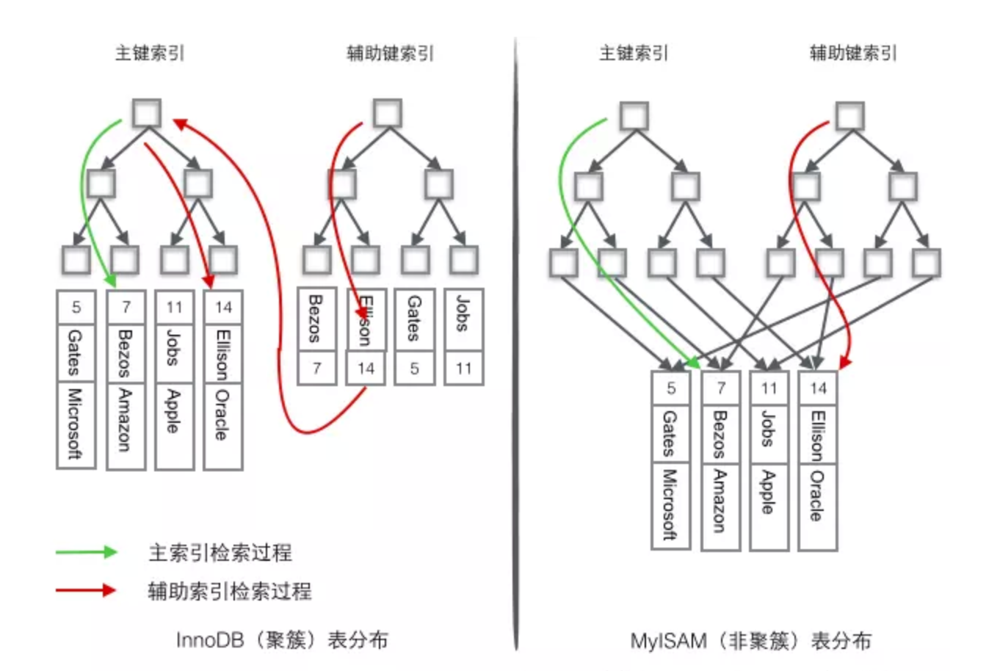

##概述
对mysql深入面试的总结。  
参考链接：https://blog.csdn.net/hollis_chuang/article/details/95167242

**B+ 和hash**  
1.B+可排序，可左匹配
2.Hash适合等值查询,大量重复数据会拖慢效率  

查询优化
**聚簇索引、覆盖索引**

不需要回表操作：
1.聚蔟索引（主键索引）
2.查询索引。在索引里直接命中了相关信息。（覆盖索引）

**索引下推：**
针对联合索引，简单而言在索引里进行判断，从而减少回表的过程。  
Index Condition Pushdown（索引下推） MySQL 5.6引入了索引下推优化，默认开启，
使用SET optimizer_switch = ‘index_condition_pushdown=off’;
可以将其关闭。官方文档中给的例子和解释如下： people表中（zipcode，lastname，firstname）构成一个索引
SELECT * FROM people WHERE zipcode=‘95054’ AND lastname LIKE ‘%etrunia%’ AND address LIKE ‘%Main Street%’;
如果没有使用索引下推技术，则MySQL会通过zipcode='95054’从存储引擎中查询对应的数据，返回到MySQL服务端，然后MySQL服务端基于lastname LIKE '%etrunia%'和address LIKE '%Main Street%'来判断数据是否符合条件。
如果使用了索引下推技术，则MYSQL首先会返回符合zipcode='95054’的索引，然后根据lastname LIKE '%etrunia%'和address LIKE '%Main Street%'来判断索引是否符合条件。
如果符合条件，则根据该索引来定位对应的数据，如果不符合，则直接reject掉。 有了索引下推优化，可以在有like条件查询的情况下，减少回表次数。

**查询优化步骤：**
1、根据搜索条件，找出所有可能使用的索引   
2、计算全表扫描的代价  
3、计算使用不同索引执行查询的代价   
4、对比各种执行方案的代价，找出成本最低的那一个  